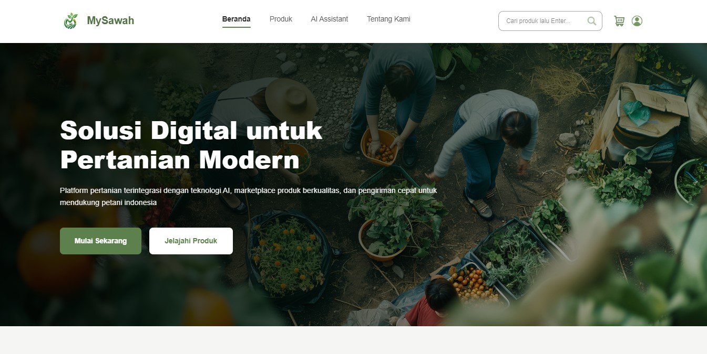
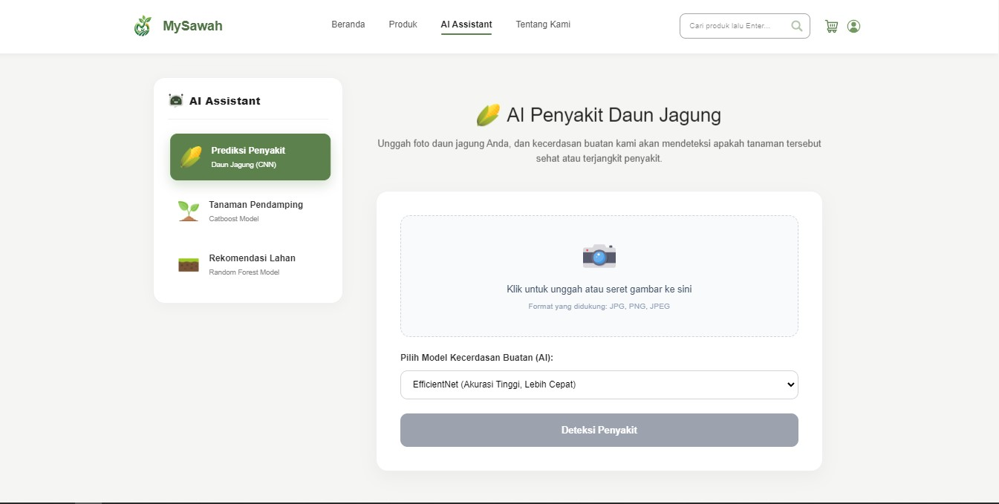
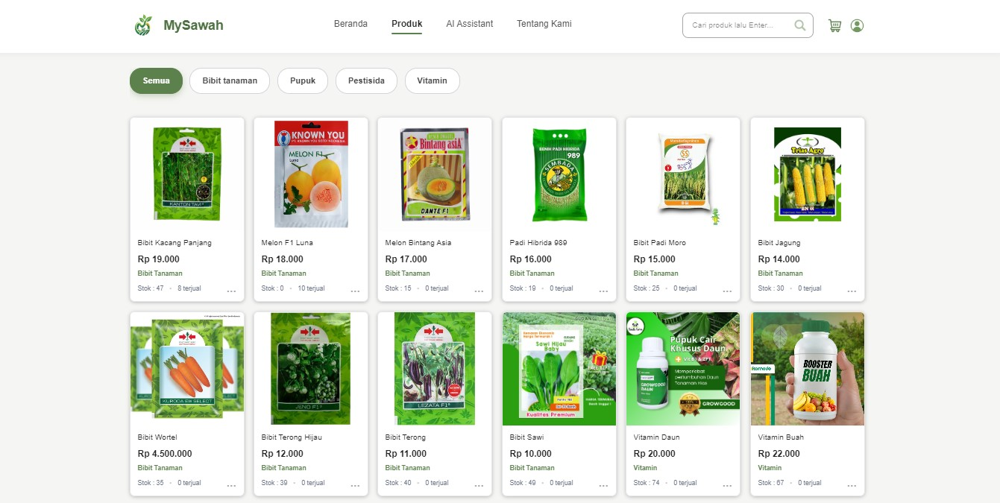

# MySawah - Platform Integrasi Pertanian Modern dan Kecerdasan Buatan

MySawah adalah platform digital terintegrasi yang menggabungkan ekosistem Agri-Commerce dengan modul analisis berbasis Kecerdasan Buatan (AI). Platform ini dirancang untuk mengoptimalkan pengelolaan lahan, mendeteksi penyakit tanaman secara dini, serta menentukan kombinasi tanaman tumpang sari yang paling efektif guna mendukung ketahanan pangan dan efisiensi operasional pertanian.

## Fitur Utama

1. **AI Deteksi Penyakit Daun**
   Modul computer vision (EfficientNet & ResNet) untuk mendeteksi penyakit Hawar Daun, Karat Daun, Bercak Daun Abu-abu, atau kondisi sehat, lengkap dengan rekomendasi penanganan taktis.

2. **AI Tanaman Pendamping**
   Sistem prediktif menggunakan CatBoost Classifier untuk memvalidasi dan menentukan tingkat kecocokan pola tanam tumpang sari antar-tanaman (Membantu, Dibantu, atau Hindari).

3. **AI Rekomendasi Lahan**
   Modul prediksi komoditas menggunakan algoritma Random Forest untuk merekomendasikan jenis tanaman terbaik berdasarkan parameter N-P-K, suhu, kelembapan, pH tanah, dan curah hujan.

4. **Agri-Commerce Marketplace**
   Sistem perdagangan elektronik untuk mendistribusikan produk pertanian seperti pupuk, pestisida, dan bibit unggul secara langsung kepada pengguna.

5. **Sistem Autentikasi dan Manajemen Profil**
   Sistem keamanan komprehensif yang mengelola sesi pengguna, pendaftaran akun, dan manajemen otorisasi akses halaman.

---

## Tampilan Antarmuka (Screenshots)

**1. Halaman Beranda**

*Antarmuka utama yang menyajikan navigasi cepat ke seluruh ekosistem MySawah.*

**2. Modul AI Rekomendasi Lahan**

*Antarmuka analisis AI yang memberikan hasil deteksi secara langsung.*

**3. Agri-Commerce Marketplace**

*Katalog produk pertanian digital.*

---
### Teknologi yang kami gunakan

| Komponen | Core Framework / Bahasa | Pustaka & Alat Utama |
| :--- | :--- | :--- |
| **Backend API** |  | Eloquent ORM, Artisan CLI, MySQL |
| **Frontend UI** |  | Pinia State Management, Vue Router, Axios |
| **AI Module** |   | CatBoost, Random Forest, EfficientNet, ResNet, Pandas |

---

## Struktur Direktori Proyek

Proyek `MySawah` ini dibagi menjadi 2 repositori/direktori utama yang saling terhubung:
- `backend/`: Modul API, manajemen otentikasi, dan basis data (Laravel).
- `frontend/`: Modul antarmuka pengguna interaktif klien (Vue.js).

---

## Petunjuk Pemakaian dan Instalasi

Ikuti langkah-langkah di bawah ini untuk menjalankan ekosistem penuh MySawah.

### 1. Konfigurasi Backend (Laravel)

#### Masuk ke direktori backend:
```bash
cd backend
```

#### Instalasi seluruh pustaka dan dependensi:
```Bash
composer install
```

#### Lakukan pengaturan file environment. Salin konfigurasi bawaan dan sesuaikan kredensial basis data Anda:
```Bash
cp .env.example .env
```

#### Hasilkan application key yang digunakan untuk enkripsi:
```Bash
php artisan key:generate
```

#### Tautkan direktori penyimpanan untuk visibilitas aset publik:
```Bash
php artisan storage:link
```

#### Jalankan migrasi basis data sekaligus menanamkan data awal (seeder):
```Bash
php artisan migrate:fresh --seed
```

#### Jalankan backend:
```Bash
php artisan serve
```

### 2. Konfigurasi Frontend (Vue.js)

#### Buka terminal baru dan masuk ke direktori frontend:
```Bash
cd frontend
```

#### Instalasi pustaka Node.js:
```Bash
npm install
```

#### Jalankan peladen pengembangan antarmuka:
```Bash
npm run dev
```
---

## Lisensi Penggunaan

Platform ini didistribusikan secara terbuka khusus untuk tujuan **Pembelajaran, Riset, dan Edukasi Akademik**. 

* **Ketentuan Penggunaan:** Kode sumber dalam proyek ini bebas untuk dipelajari, dimodifikasi secara lokal, dan digunakan sebagai referensi studi kasus tugas akhir atau proyek akademis.
* **Pembatasan:** Sangat dilarang keras menyalahgunakan, memperjualbelikan, atau mengomersialkan seluruh atau sebagian komponen dari sistem ini tanpa izin tertulis dari pengembang platform MySawah.

---
